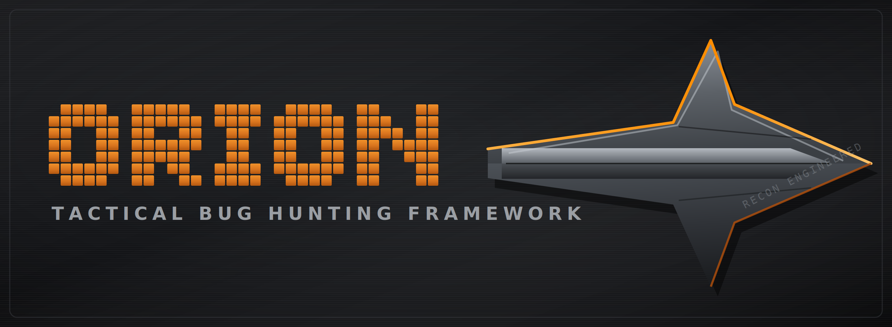

<p align="center">
  
</p>

<p align="center">
  
  
  
  
  
</p>

An AI-driven bug-hunting orchestration framework: it wraps standard Go security
tooling (Subfinder, Httpx, Ffuf, Nuclei, Masscan) behind an `asyncio` engine and
augments the pipeline with LLM-based false-positive triage, context-aware
template selection, WAF-aware pacing, and crash-safe state. Built to run natively
on Arch Linux and tuned for 16 GB machines.

> ⚠️ **Authorized use only.** ORION is for security testing of systems you own or
> are explicitly authorized to assess (e.g. a bug-bounty program's in-scope
> assets). It ships with a hard scope guard that refuses to launch against any
> host not listed in your rules-of-engagement file. Keep it that way.

## Features

- **Async hybrid pipeline** — recon → probe → fuzz → vuln → triage, wrapping
  external binaries with `asyncio.create_subprocess_exec` (non-blocking, hard
  timeouts, process-group kill on overrun).
- **AI triage bridge (MCP-compatible)** — ships raw Nuclei/Httpx logs to a local
  (Ollama) or remote (OpenAI-compatible / Anthropic) LLM for false-positive
  filtering and attack-vector suggestion. Also speaks to a HexStrike-style tool
  server.
- **Context-aware execution** — Httpx tech fingerprint drives Nuclei `-tags`, so
  a React/Node target never gets the WordPress template corpus.
- **WAF-aware queueing** — per-host token bucket with randomized jitter and
  adaptive slowdown (aggressive → normal → conservative → stealth) on 429/403.
- **Crash-safe state (SQLite)** — every task transition is persisted; interrupt
  it and it resumes exactly where it left off.
- **Resource governor** — concurrency derived from real available RAM (`psutil`),
  so it self-tunes and won't starve a 16 GB box.
- **Daemon notifications** — Discord/Telegram webhooks fire only on AI-validated
  High/Critical findings.
- **OSINT enrichment** — scope-gated, metadata-only breach lookups.

## Project layout

```
orion/
├── orion/
│   ├── main.py                 # CLI + daemon entrypoint
│   ├── core/
│   │   ├── models.py           # Task / Finding / Asset + state enums
│   │   ├── config.py           # Scope, resource envelope, AI, notify config
│   │   ├── state.py            # async SQLite store + crash-resume
│   │   ├── governor.py         # ResourceGovernor + WAFRateLimiter
│   │   └── orchestrator.py     # asyncio event loop, queue, workers
│   ├── ai/mcp_bridge.py        # HexStrike tool client + LLM triage bridge
│   ├── recon/planner.py        # context-aware tech→tags + parsers
│   ├── enrich/leaks.py         # breach/OSINT enrichment (scope-gated)
│   ├── notify/webhook.py       # Discord / Telegram notifiers
│   └── ui/banner.py            # "The Arrowhead" CLI banner
├── scope.example.json          # rules-of-engagement template
├── requirements.txt
├── pyproject.toml
└── LICENSE
```

## Install

### Arch Linux — one command

Installs system deps, the Go tools (subfinder, httpx, nuclei, ffuf, dalfox),
masscan, the nuclei templates, and ORION's Python venv — then prints a summary:

```bash
git clone https://github.com/1337strike/orion.git
cd orion
chmod +x install.sh && ./install.sh
```

The script is idempotent (safe to re-run) and reports any tool it couldn't
install rather than aborting.

### Manual

```bash
git clone https://github.com/1337strike/orion.git
cd orion
python -m venv .venv && source .venv/bin/activate
pip install -r requirements.txt
```

External tools are expected on `PATH`. On Arch:

```bash
# via the Go toolchain / AUR, e.g.
go install github.com/projectdiscovery/subfinder/v2/cmd/subfinder@latest
go install github.com/projectdiscovery/httpx/cmd/httpx@latest
go install github.com/projectdiscovery/nuclei/v3/cmd/nuclei@latest
go install github.com/ffuf/ffuf/v2@latest
go install github.com/hahwul/dalfox/v2@latest
sudo pacman -S masscan   # or: yay -S masscan
```

## Usage

Preview the banner:

```bash
python -m orion.ui.banner
```

Define your scope (copy and edit the template):

```bash
cp scope.example.json scope.json
```

Run a scan:

```bash
python -m orion.main --target acme.com --scope scope.json
```

Local, private AI triage via Ollama (recommended on 16 GB):

```bash
ollama pull llama3.1:8b
python -m orion.main --target acme.com --scope scope.json \
    --ai-provider ollama --ai-model llama3.1:8b
```

Notifications (daemon mode):

```bash
export ORION_DISCORD_WEBHOOK="https://discord.com/api/webhooks/..."
# or Telegram:
export ORION_TELEGRAM_TOKEN="..." ORION_TELEGRAM_CHAT="..."
```

Interrupt any run with `Ctrl-C` — state is flushed to `~/.orion/orion.db`. Re-run
with `--resume <scan_id>` to pick up exactly where it stopped.

## Configuration notes

- **Scope** (`scope.json`) accepts glob patterns (`*.acme.com`) and CIDRs
  (`10.0.0.0/8`); out-of-scope always wins over in-scope. Private ranges are
  refused unless `allow_private_ranges` is true.
- **Resource envelope** reserves headroom for the OS and a local model; tune
  `ResourceConfig` in `orion/core/config.py` if you run a larger LLM.
- **Secrets** come from environment variables only — never commit `scope.json`,
  `.env`, or `~/.orion/`. They're already in `.gitignore`.

## License

MIT — see [LICENSE](LICENSE).
